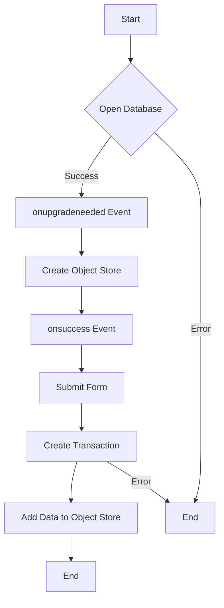

# IndexedDB JavaScript Code Explanation

This JavaScript code uses the IndexedDB API to create a database, store user data, and display it in a table.

## Code Breakdown

1. **Opening the Database**

    ```javascript
    let openRequest = indexedDB.open("myDatabase", 1);
    ```

    The `indexedDB.open` function is used to open a database. It takes two arguments: the name of the database and the version. If the database doesn't exist, it's created.

2. **Creating the Schema**

    ```javascript
    openRequest.onupgradeneeded = function () {
        let db = openRequest.result;
        if (!db.objectStoreNames.contains('user_data')) {
            db.createObjectStore('user_data', { keyPath: 'id', autoIncrement: true });
        }
    };
    ```

    The `onupgradeneeded` event is triggered when the database is opened with a higher version number than the existing stored database. Here, an object store named 'user_data' is created if it doesn't already exist. The `keyPath` option is set to 'id', which will be used as the key for the stored objects, and `autoIncrement` is set to true, meaning the 'id' will automatically increment for each new object.

3. **Error Handling**

    ```javascript
    openRequest.onerror = function () {
        console.error("Error", openRequest.error);
    };
    ```

    The `onerror` event is triggered when an error occurs. Here, the error is logged to the console.

4. **Saving Form Data to the Database**

    ```javascript
    openRequest.onsuccess = function () {
        let db = openRequest.result;

        document.getElementById('myForm').addEventListener('submit', function (event) {
            event.preventDefault();

            var name = document.getElementById('name').value;
            var email = document.getElementById('email').value;

            let transaction = db.transaction("user_data", "readwrite");

            transaction.oncomplete = function () {
                console.log("Transaction completed");
            };

            transaction.onerror = function () {
                console.log("Transaction not completed", transaction.error);
            };

            let user_data = transaction.objectStore("user_data");
            let request = user_data.add({ name: name, email: email });
    ```

    The `onsuccess` event is triggered when the database is successfully opened. Inside this event, an event listener is added to the form to save the form data to the database when the form is submitted. A transaction is created with readwrite permissions on the 'user_data' object store, and the form data is added to the object store.

5. **Displaying the Data in a Table**

    ```javascript
            request.onsuccess = function () {
                console.log("User data added to the database");

                document.getElementById('name').value = '';
                document.getElementById('email').value = '';

                let transaction = db.transaction("user_data", "readonly");
                let user_data = transaction.objectStore("user_data");
                let request = user_data.getAll();

                request.onsuccess = function () {
                    let users = request.result;
                    let table = document.getElementById('userTable');
                    table.innerHTML = '';

                    let headerRow = document.createElement('tr');
                    let nameHeader = document.createElement('th');
                    let emailHeader = document.createElement('th');

                    nameHeader.textContent = 'Name';
    ```

    After the user data is successfully added to the database, the form is cleared and a new transaction is created with readonly permissions on the 'user_data' object store. The `getAll` method is used to get all objects in the object store, and the data is displayed in a table.

6. **Flowchart of IndexedDB Operations**

	


<div align="center">


